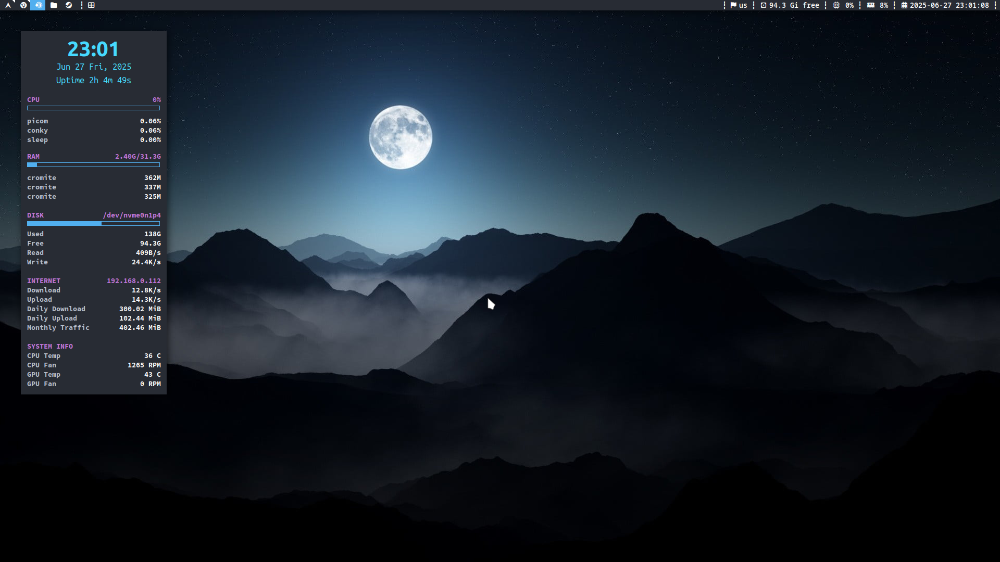

# Arch Dusk Dotfiles
*with suckless software included!*

## Installation

**CLONE INTO ~/Dotfiles DIRECTORY OR MOST OF THE THINGS WILL BREAK**

1. Install required packages (including AUR): base base-devel linux linux-firmware grub efibootmgr git networkmanager dhcpcd sudo vim htop ufw pulsemixer polkit-gnome pipewire pipewire-pulse wireplumber rtkit xorg xorg-xinit xdotool xclip libnotify dunst feh maim yazi picom nsxiv mpv cromite-bin qt5-styleplugins yay zoxide ttf-jetbrains-mono-nerd ttf-ubuntu-font-family ttf-apple-emoji ttf-noto-nerd helix eza conky vnstat stow fzf breezex-cursor-theme j4-dmenu-desktop arc-gtk-theme arc-icon-theme xkblayout-state-git
2. Enable services: dhcpcd, NetworkManager, ufw, pipewire, pipewire-pulse, wireplumber, vnstat
3. Move {dusk,dmenu,st,slstatus}-sus and xmenu to user's home and build them
4. cd ~/Dotfiles and stow .
5. Base installation done!

**Optional Dependencies** - starship jgmenu libva flatpak rtorrent

*Run "stow ." and then "diffconfig" after git pull*

## Extra
*mostly reminders for myself*

* Move xorg.conf's into /etc/X11/xorg.conf.d/
* For Variable Refresh Rate properly paste code from drirc-mesa to /usr/share/drirc.d/00-mesa-defaults.conf
* Add Color and ILoveCandy to pacman (ParallelDownloads = 5 if not set)
* Install Microsoft fonts
* Change "monospace" font to something better in /etc/fonts/local.conf
* Move .local/bin/{hub-script,conky-toggle,update-status.sh} to /usr/local/bin directory
* do sensors-detect (carefully) for conky temps
