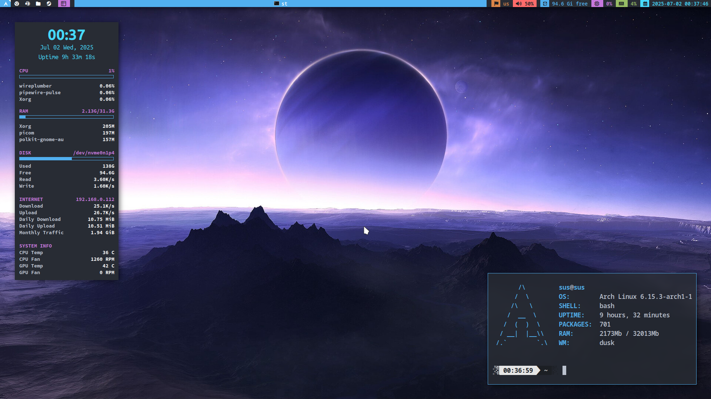

# Arch Dusk Dotfiles
*with suckless software included!*



## Installation

1. git clone https://github.com/NoTArZuZ/Dotfiles-Arch **~/Dotfiles**
2. Install required packages (including AUR):\
```base base-devel linux linux-firmware grub efibootmgr git networkmanager sudo vim htop ufw polkit-gnome pipewire pipewire-pulse wireplumber rtkit xorg xorg-xinit xdotool xclip libnotify dunst feh maim yazi picom nsxiv mpv cromite-bin qt5-styleplugins yay ttf-jetbrains-mono-nerd ttf-ubuntu-font-family ttf-apple-emoji ttf-noto-nerd helix eza conky vnstat stow breezex-cursor-theme j4-dmenu-desktop arc-gtk-theme arc-icon-theme xkblayout-state-git wiremix```
3. Enable services: NetworkManager, ufw, pipewire, pipewire-pulse, wireplumber, vnstat
4. Move {dusk,dmenu,st,slstatus}-sus and xmenu to user's home and build them
5. cd ~/Dotfiles and stow .
6. Move .local/bin/{hub-script,conky-toggle,root-xmenu} to /usr/local/bin directory
7. Base installation done!

**Optional Packages** - starship zoxide fzf jgmenu libva flatpak rtorrent dragon-drop polybar sxhkd\
**Optional WMs** - awesome bspwm

## Updating

1. cd ~/Dotfiles
2. git pull
3. stow .
4. Check non stow'ed files with diffconfig
5. Copy/Replace missing or changed files

## Extra
*mostly reminders for myself*

* **Important** Extra WM configs also use my modified suckless software, so make sure you've installed st, dmenu, xmenu and slstatus
* Move xorg.conf's into /etc/X11/xorg.conf.d/
* Move Extra/fonts-local.conf into /etc/fonts/local.conf
* For Variable Refresh Rate properly paste code from drirc-mesa to /usr/share/drirc.d/00-mesa-defaults.conf
* Add Color and ILoveCandy to pacman (ParallelDownloads = 5 if not set)
* Do sensors-detect (carefully) for conky temps
* Install Microsoft fonts
