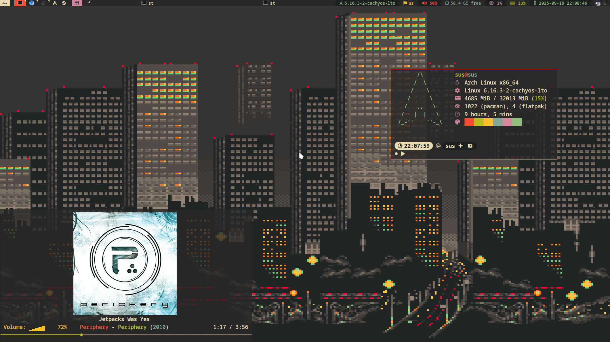
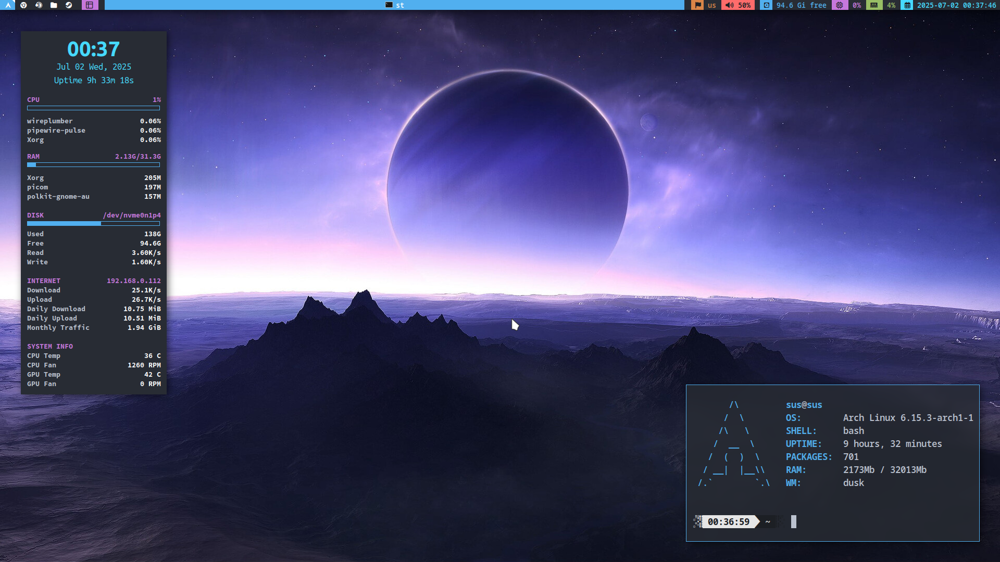

# Arch Dusk Dotfiles
*with suckless software included!*




## Installation

1. git clone https://github.com/NoTArZuZ/Dotfiles-Arch **~/Dotfiles**
2. Install required packages (including AUR):\
```base base-devel linux linux-firmware grub efibootmgr git networkmanager sudo vim htop fastfetch ufw polkit-gnome pipewire pipewire-pulse wireplumber rtkit xorg xorg-xinit xdotool xclip libnotify dunst feh maim yazi picom nsxiv mpv cromite-bin qt5-styleplugins qt6gtk2 yay ttf-jetbrains-mono-nerd ttf-ubuntu-font-family ttf-apple-emoji ttf-noto-nerd helix eza conky vnstat stow apple_cursor j4-dmenu-desktop mint-themes mint-y-icons xkblayout-state-git wiremix```
3. Enable services: NetworkManager, ufw, pipewire, pipewire-pulse, wireplumber, vnstat
4. Move {dusk,dmenu,st,slstatus}-sus and xmenu to user's home and build them
5. cd ~/Dotfiles and stow .
6. Base installation done!

**Optional Packages** - starship zoxide fzf jgmenu libva flatpak rtorrent dragon-drop polybar sxhkd picom-ftlabs-git neomutt mutt-wizard-git newsboat weechat\
**Optional WMs** - awesome bspwm

## Updating

1. cd ~/Dotfiles
2. git pull
3. stow .
4. Manually Copy/Replace missing or changed files (use **qdiff** for checking folders)

## Extra
*mostly reminders for myself*

* **Important** Extra WM configs also use my modified suckless software, so make sure you've installed st, dmenu, xmenu and slstatus
* Move Extra/xorg.conf.d/*configs* into /etc/X11/xorg.conf.d/
* Move Extra/fonts/local.conf into /etc/fonts/local.conf
* Add Color and ILoveCandy to pacman (ParallelDownloads = 5 if not set)
* Do sensors-detect (carefully) for conky temps
* Install Microsoft fonts
* To use libvirt edit /etc/libvirt/network.conf firewall = iptables
* Use linkhandler in urlview by editing /etc/urlview.conf
* Symlink yt-dlp to youtube-dl to use mpv over internet
